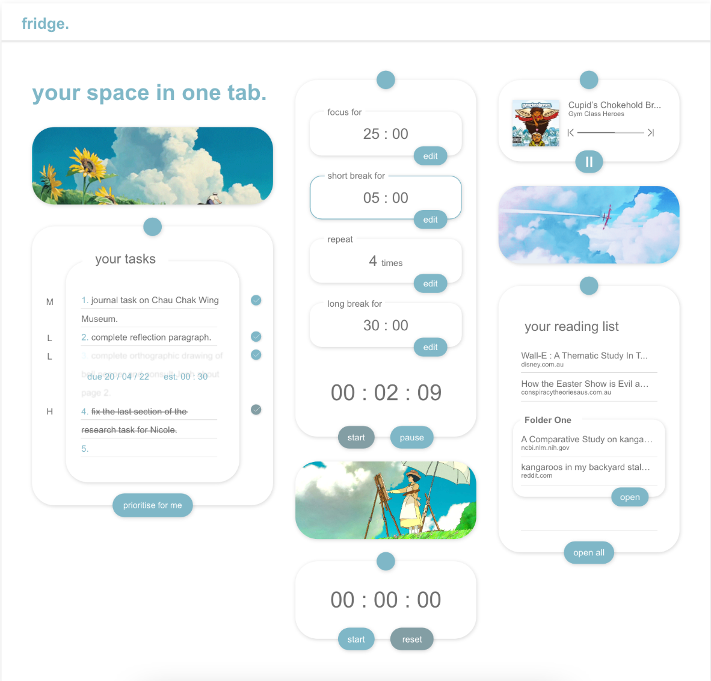

# Fridge

fridge, as its name suggests, is a digital version of how people use their own fridges; a single space where they can hang all sorts of things - from timers to lists. fridge is a web application version of this. It provides students a comprehensive array of tools that can be employed for effective studying. It performs this with priority for convienciance, utilising a single page to faciliate short navigation paths. Through this, the web application understands the necessity for study tools that can be passively viewed, accessed and switched between inside a single space.  

## Iterations

the final prototype for fridge differs from its mock-up concept in some major ways. This includes:

### Theme
fridge now has greater consideration for the atmosphere and mood it entails. While its mock-up version borrowed inspiration from the popular Japanese animation film studio 'Studio Ghibli', this was limited to images and colour schemes. This inspiration is further compelled in the final prototype, using the 'sky' motif more in the colour scheme, and extending Studio Ghibli to the music player. All these are employed to construct an atmosphere and mood, reminscent of the calming and peaceful feelings so many enjoy about Studio Ghibli films. It feels only appropriate to embrace students with these feelings to relax them as they study and use the application.

### Music Player
While the mock-up version called for an embedded Spotify music player, it was found to be more justiable to employ the music player to instead further enforce the Studio Ghibli theme. An overwhelming majority of students already use other music streaming platforms i.e Spotify and Apple Music that are very well-integrated for stand-by listening. Rather than attempting to be redundant, it would be better to design the music player to fit both the styling and atmosphere of the website it is in. 

### Website UI and Balance
A more minor change was a simplification of overall User Interface elements. For example, the heading 'your space in one tab' in the original mock-up was scrapped entirely. This was to help standardise the grid format of the website which otherwise became unbalanced with the inclusion of the heading. This same reasoning informed the centering of the 'fridge' title which bolsters symmetry in the overall website, synonymous with relaxation and order that studying students would prefer. Finally, it can be noted that the image in the middle column was moved to be last and below the stopwatch, rather than above it as previously conceptualised. This was done as the pomodoro timer would be shorter than expected, and it led to a cluster of images in the top half of the website. Moving the image to the very bottom ensures the images are scattered with balance and respect to the design principles of harmony.

## Reflection

### Challenges
- Being able to commit to a responsive website was especially difficult and I could have given more consideration to the mobile version. 
- When trying to implement multiple codes from different sources, I found it challenging to suit it to my existing code. I found myself having to edit a lot of tags, or simply leaving things alone, to ensure the code worked while most likely leaving code that could have definitely been more organised, and less redundant. 
- Javascript, being a newer language to myself, was harder to be able to do entirely on my own and therefore I relied on using code from elsewhere.
- Covey Quadrants, the function I removed entirely, was very difficult to find help for online. Had it been afforded, I would have looked to switch to the Kanban Board. 

## CODE REFERENCES 

-- **Task List** --  
Dongas R. (2022) *InteractiveTaskList.* Retrieved From https://replit.com/@robdongas/InteractiveTaskList.

-- **Stopwatch Timer** --  
Programming with Lam (2021, September 10) *Stopwatch with JavaScript.* [Video File] Retrieved from https://www.youtube.com/watch?v=bOyNOENYIw0&ab_channel=ProgrammingwithLam and https://github.com/kaizhelam/Stopwatch. 

-- **Music Player** --  
Shankar, B. (2020) *ipod like music player using HTML CSS and Javascript.* Retrieved from https://riseprogramming.blogspot.com/2020/09/blog-post_23.html

-- **Pomodoro Timer** --  
abhik b. (2021, January 5) *Mini Javascript Project - Pomodoro Timer with Circular Progress Indicator (Vanilla JS , HTML ,CSS).* [Video File] Retrieved from https://www.youtube.com/watch?v=MtYR2vCs2R0&ab_channel=abhikb and https://github.com/abhik-b/pomodro-timer

-- **Reading List** --  
Roshdy, A. (2021, September 3) *Bookmark App using Vanilla.JS , CSS and HTML* [Video File] Retrieved from https://www.youtube.com/watch?v=XVed3oGAx3M&t=88s&ab_channel=AhmedRoshdy

-- **Overall Grid Layout** --  
The Net Ninja (2017, September 25) *CSS Grid Tutorial #4 - Grid Lines.* [Video File] Retrieved from https://www.youtube.com/watch?v=J5GWyiWU2H8&ab_channel=TheNetNinja

-- **Styling CSS Buttons** --  
Gowtham Tirri (2020, June 3) *Build A StopWatch Using Vanilla JavaScript Tutorial.* [Video File] Retrieved from https://www.youtube.com/watch?v=oMwaMYwHkS8

## ASSET REFERENCES 

Hisaishi, J. (2020) *Joe Hisaishi - Merry-Go-Round (from 'Howl's Moving Castle')* [Music]. https://www.youtube.com/watch?v=Cj-AL-J98U0&ab_channel=JoeHisaishiVEVO

Studio Ghibli (2004) *Howls Moving Castle : Castle Scene [Movie Screenshot] Toho Co., Ltd.* https://manofmany.com/entertainment/movies-tv/real-life-howls-moving-castle-studio-ghibli-theme-park

Studio Ghibli (1998) *My Neighbour Totoro : Sunflowers Scene [Movie Screenshot] Toho Co., Ltd.* 
https://64.media.tumblr.com/5e599f261b1c471bdbf57e52c0028678/tumblr_plfsfqo0Gk1rbud4zo1_500.gifv

Studio Ghibli (1992) *Porco Rosso : Flying Plane Scene [Movie Screenshot] Toho Co., Ltd.*
https://44.media.tumblr.com/7b4bd44c7c0ef125bb233883c355b00c/f91863fa3dfe53e0-d8/s500x750_f1/f91657fe22b9da77b899ac5937f84f76071e9177.gifv 

Studio Ghibli (2013) *The Wind Rises : Painting Scene [Movie Screenshot] Toho Co., Ltd.*
https://www.wallpaperflare.com/studio-ghibli-nature-landscape-the-wind-rises-colorful-wallpaper-yhkxz